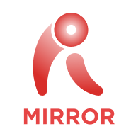

  
  <h1 align="center">RevoMirror-Android</h1>
  <h4 align="center">面向 Android 的 RevoMirror 局域网投屏客户端。</h4>

  
  
  

  <a href="README.md">English</a> | <b>简体中文</b>

## 项目简介

**RevoMirror-Android** 是由 **Revopoint Software**
开发的 Android 投屏与远程控制客户端。它基于开源项目
[Moonlight Android](https://github.com/moonlight-stream/moonlight-android)
二次开发，遵循 GPL-3.0 许可证。

RevoMirror-Android 的核心功能包括：

- **PC 屏幕投屏**：将已配对 PC 的桌面画面实时显示到 Android 设备。
- **触控远程控制**：通过 Android 设备的触控输入控制远端桌面。
- **局域网互联**：在同一局域网或同一网段内连接主机，获得低延迟串流体验。
- **RevoMirror 工作流**：支持发现、手动添加、配对并连接 RevoMirror 兼容主机。

> **说明：** RevoMirror-Android 是基于 Moonlight Android 的衍生项目。
> 核心串流客户端、输入管线、解码集成以及 NVIDIA GameStream / Sunshine
> 协议支持继承自 Moonlight Android。RevoMirror-Android 在此基础上增加了
> RevoMirror 界面、配对流程、触控交互、多语言、法务文档展示和 Android
> 打包相关改动。

## 主要特性

- **Android 客户端**：支持 Android 手机和平板设备。
- **PC 到 Android 投屏**：将 Windows 或 macOS 主机桌面投屏到 Android。
- **触控控制**：将触控输入回传到主机，实现远程桌面操作。
- **双指缩放与拖拽**：支持通过双指手势缩放和移动投屏画面。
- **设备发现与配对**：可在局域网内发现主机、手动添加主机，并通过 PIN 码配对。
- **RevoMirror 自定义界面**：包含启动页、设备列表、配对弹窗、设置页和加载状态。
- **语言设置**：支持在应用内切换 RevoMirror 界面语言。
- **许可与政策展示**：应用内置 GPLv3、用户协议和隐私政策文档。

## 工作原理

RevoMirror-Android 基于 Moonlight Android 代码构建，并保留其底层串流能力：

- **Moonlight Android 客户端栈**：用于主机发现、配对、串流、解码和输入处理。
- **moonlight-common-c / MoonBridge**：提供原生串流协议层。
- **Android MediaCodec**：在支持的设备上使用硬件视频解码。
- **触控与输入处理**：针对 RevoMirror 远程桌面控制场景进行了适配。

在此基础上，RevoMirror-Android 提供面向 RevoMirror-PC 或 Sunshine 兼容主机的
Android 应用体验。

## 平台支持

| 角色 | Android | Windows | macOS |
|------|:-------:|:-------:|:-----:|
| 客户端（观看 / 控制） | 支持 | 不适用 | 不适用 |
| 主机端（被投屏 / 被控制） | 不适用 | 通过 RevoMirror-PC / Sunshine 支持 | 通过 RevoMirror-PC / Sunshine 支持 |

## 系统要求

### Android 客户端

| 组件 | 要求 |
|------|------|
| 操作系统 | Android 7.0 或更高版本 |
| CPU / GPU | 建议使用支持硬件视频解码的设备 |
| 网络 | 建议使用 5 GHz Wi-Fi 或有线以太网适配器 |
| 连接 | 与主机 PC 处于同一局域网 / 同一网段 |

### 主机 PC

RevoMirror-Android 用于连接兼容的 RevoMirror-PC 或基于 Sunshine 的主机。
主机端要求取决于底层串流主机能力，包括可用的硬件加速屏幕采集和视频编码能力。

## 快速开始

1. 在主机电脑上安装并运行 RevoMirror-PC。
2. 在 Android 设备上安装 RevoMirror-Android。
3. 确保 Android 设备与主机 PC 处于同一局域网或同一网段。
4. 打开 RevoMirror-Android，选择自动发现的主机，或手动添加主机。
5. 使用界面显示的 PIN 码与主机配对。
6. 开始投屏，并通过触控手势查看或控制桌面。

## 编译

1. 安装 Android Studio、Android SDK 35 和 Android NDK `27.0.12077973`。
2. 克隆仓库，并在需要时初始化子模块。
3. 使用 Android Studio 打开 `RevoMirror-Android`。
4. 创建一个名为“local.properties”的文件。在该文件中添加“sdk.dir=”属性，并将其值设置为您的SDK目录路径。
5. 构建 `app` 模块，可选择 `nonRoot` 或 `root` product flavor。

## 文档

- 修改说明：[CHANGES.md](CHANGES.md)
- 上游客户端：[Moonlight Android](https://github.com/moonlight-stream/moonlight-android)
- 兼容主机引擎：[Sunshine](https://github.com/LizardByte/Sunshine)

## 许可证

RevoMirror-Android 遵循 **GNU 通用公共许可证 v3.0（GPL-3.0）**。

本项目是基于
[Moonlight Android](https://github.com/moonlight-stream/moonlight-android)
的衍生作品，Moonlight Android 同样遵循 GPL-3.0 许可证。根据 GPL 的相关条款，
RevoMirror-Android 以相同许可证进行分发。

完整许可证文本请参见
[LICENSE](./LICENSE)。

## 致谢与声明

RevoMirror-Android 基于以下优秀的开源项目构建：

- **[Moonlight Android](https://github.com/moonlight-stream/moonlight-android)**：
  面向 NVIDIA GameStream 和 Sunshine 的开源 Android 客户端。
- **[Moonlight Common C](https://github.com/moonlight-stream/moonlight-common-c)**：
  Moonlight 客户端使用的原生串流协议库。
- **[Sunshine](https://github.com/LizardByte/Sunshine)**：
  与 Moonlight 兼容的自托管串流主机。

在此向 Moonlight 和 Sunshine 项目的团队及所有贡献者致以诚挚感谢。本仓库完整保留了
原始许可证与版权声明。
